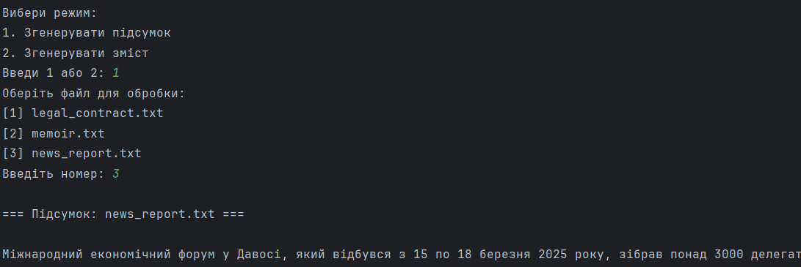
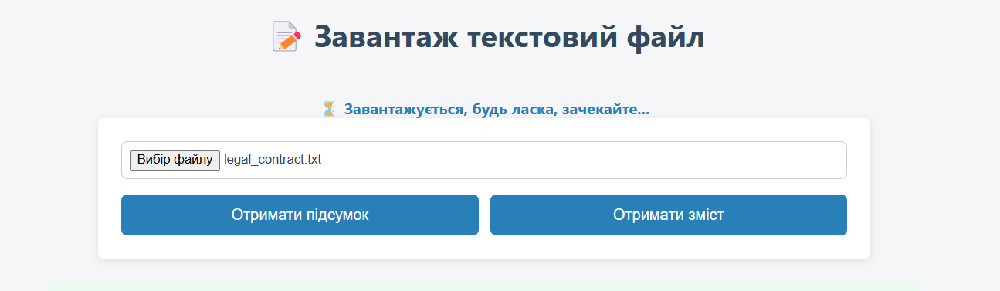
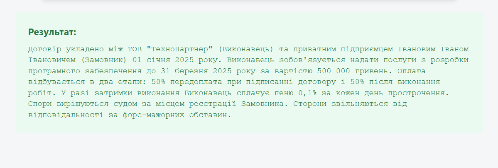
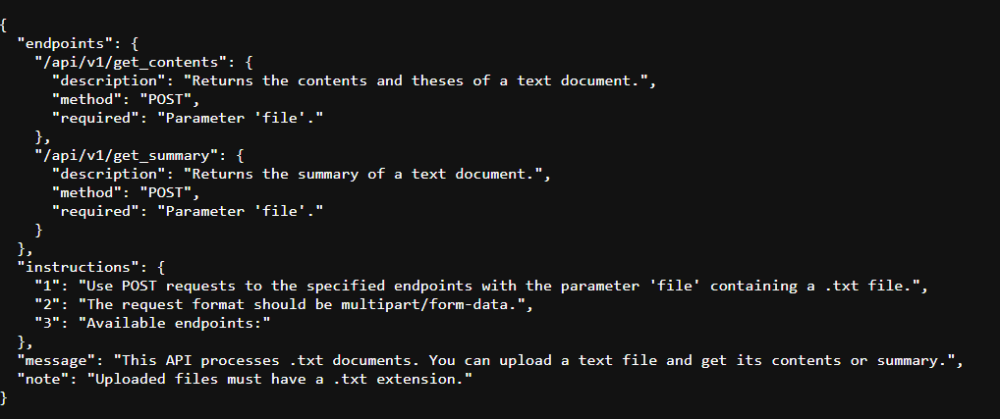
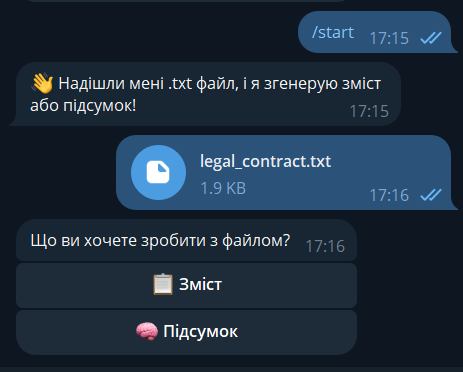

# AI summarizer project
Система для аналізу текстових документів з використанням LLM (OpenAI API)

## Зміст
1. [Встановлення](#встановлення)
2. [Запуск та використання](#запуск-та-використання)
3. [Формат конфігурації](#формат-конфігурації)
4. [Логи та метрики](#логи-та-метрики)
5. [Діаграма системи](#діаграма-системи)

---

## Встановлення
### Вимоги
- Python 3.9 або вище
- API-ключ для моделі OpenAI 
- Telegram бот 

### Кроки:
1. Клонуйте репозиторій:
   ```bash
   git clone https://github.com/nadiina/ai-summarizer-project.git
   cd ai-summarizer-project
    ```
2. Створіть файл середовища .env на основі .example.env та вставте ваші ключ (OPENAI_API_KEY, TELEGRAM_TOKEN)
   
3. Встановіть залежності:
```bash
python -m venv venv
source venv/bin/activate  # або .\venv\Scripts\activate для Windows
pip install -r requirements.txt
```

---

## Запуск та використання

1. Скрипти (CLI)
```bash
python scripts/get_summary.py шлях/до/файлу.txt
python scripts/get_contents.py шлях/до/файлу.txt
```
Для зручного тестування є можливість запустити скрипт, де обрати режим та файл з папки __example_docs__

```bash
python test_scripts_2modes.py
```

<p align="center">
  
</p>


2. Веб-інтерфейс
```bash
flask --app web.app run
```
Перейдіть у браузері за адресою http://127.0.0.1:5000 та завантажте текстовий файл.

<p align="center">
  
</p>

Отриманий результат:

<p align="center">
  
</p>

3. Режим REST API
```bash
flask --app api.endpoints run
```

<p align="center">
  
</p>

POST /summary — отримати підсумок
```
curl -X POST -F "file=@documents/sample.txt" http://127.0.0.1:5000/summary
```

POST /contents — отримати зміст
```
curl -X POST -F "file=@documents/sample.txt" http://127.0.0.1:5000/contents
```

4. Telegram бот
```bash
python telegram_bot/bot.py
```
Надішліть /start та отримайте інструкцію щодо надіслання .txt файлу, а потім виберіть режим: Summary або Contents.

<p align="center">
  
</p>

---

## Формат конфігурації

Файл `.env`:

| Змінна           | Опис                                                       |
|------------------|------------------------------------------------------------|
| `OPENAI_API_KEY` | Ваш ключ API для OpenAI                                   |
| `LLM_MODEL`      | Назва моделі (за замовчуванням `gpt-4o-mini`)             |
| `LLM_TIMEOUT`    | Таймаут для запитів (у секундах)                           |
| `TELEGRAM_TOKEN` | Токен Telegram бота (опційно, використовується для бота)  |

---

## Логи та метрики
Система веде детальний облік усіх дій користувача, взаємодії з LLM та витрат токенів. Усі логи зберігаються в каталозі `logs/`.
### Усі логи зберігаються в каталозі __logs/__.

Лог файлу додатку `logs/app.log`
Цей лог містить інформаційні повідомлення про ключові події в додатку: запуск сервера, обробку запитів, надсилання файлів, звернення до API тощо.

__Формат__: РІК-МІСЯЦЬ-ДЕНЬ ГГ:ХХ:СС [РІВЕНЬ] НазваЛогера: Повідомлення

```
2025-04-25 11:33:22 [INFO] libs.context: Процес аналізу текста розпочато.
2025-04-25 11:33:28 [INFO] summary: Загально витрачено часу (включаючи логування): 6.14 сек.
2025-04-25 11:33:38 [INFO] libs.context: Процес аналізу текста розпочато.
2025-04-25 11:33:49 [INFO] contents: Загально витрачено часу (включаючи логування): 10.86 сек.
2025-04-25 11:33:53 [INFO] GlobalLogger: Запуск Flask-додатку
2025-04-25 11:33:55 [INFO] GlobalLogger: Запуск Flask-додатку
2025-04-25 11:33:55 [INFO] GlobalLogger: Отримано GET запит на '/' від 127.0.0.1
2025-04-25 11:34:00 [INFO] GlobalLogger: Отримано POST запит на '/' від 127.0.0.1
2025-04-25 11:34:01 [INFO] libs.context: Процес аналізу текста розпочато.
2025-04-25 11:34:05 [INFO] summary: Загально витрачено часу (включаючи логування): 4.94 сек.
2025-04-25 11:34:48 [INFO] GlobalLogger: Бот запущено... (polling)
2025-04-25 11:34:55 [INFO] GlobalLogger: Chat 470746311: отримано файл news_report.txt
2025-04-25 11:34:57 [INFO] GlobalLogger: Chat 470746311: надсилаю POST на http://localhost:5000/api/v1/get_summary
2025-04-25 11:34:59 [INFO] GlobalLogger: Отримано API-запит для дії 'get_summary'
2025-04-25 11:35:00 [INFO] libs.context: Процес аналізу текста розпочато.
2025-04-25 11:35:05 [INFO] summary: Загально витрачено часу (включаючи логування): 5.61 сек.
2025-04-25 11:35:05 [INFO] GlobalLogger: Файл 'news_report.txt' успішно оброблено з дією 'get_summary'
2025-04-25 11:35:05 [INFO] GlobalLogger: Chat 470746311: отримано відповідь API 200
```

### Логи взаємодії з LLM 
Результати обробки текстів за допомогою LLM фіксуються у форматі `.jsonl`:

`logs/summary.jsonl` — результати підсумків
```
{"timestamp": "2025-04-25T12:09:03.927378+03:00", "file_name": "memoir.txt", "summary": "У сучасному світі проблема якості повітря стає критичною, з щорічними смертями близько семи мільйонів людей через забруднення. Основними джерелами викидів є транспорт та промисловість. Дослідження показало, що в великих містах концентрація дрібнодисперсних частинок (PM2.5) перевищує норми ВООЗ у 2–3 рази. Авторами пропонується ряд заходів, таких як створення зелених зон, перехід на електричний транспорт і посилення контролю викидів. Однак такі ініціативи можуть мати соціальні обмеження через високу вартість і потребу в перенавчанні. В експериментах у п’яти країнах було висаджено понад 50 000 дерев, але їх ефективність ще не оцінена остаточно.", "prompt_tokens": 592, "completion_tokens": 210, "total_tokens": 802, "elapsed_seconds": 4.765}
```

`logs/contents.jsonl`  — результати змістів
```
{"timestamp": "2025-04-25T12:12:07.552330+03:00", "file_name": "memoir.txt", "summary": "1. Вступ до проблеми якості повітря\n   - \"У сучасному урбанізованому світі проблема якості повітря набуває все більшого значення.\"\n   - \"Щорічно близько сім мільйонів людей помирають унаслідок захворювань, спричинених забрудненим атмосферним повітрям.\"\n\n2. Джерела забруднення повітря\n   - \"Одним із основних джерел викидів є транспортні засоби та промислові підприємства.\"\n   - \"У великих містах з населенням понад п’ять мільйонів осіб середня концентрація дрібнодисперсних частинок (PM2.5) перевищує рекомендовані ВООЗ норми в 2–3 рази.\"\n\n3. Порівняння забруднення між містами\n   - \"У невеликих містах із населенням до трьохсот тисяч середній рівень PM2.5 було зафіксовано на рівні майже в межах допустимого діапазону.\"\n   - Дослідження показує різницю у забрудненні між великими та малими містами.\n\n4. Запропоновані заходи для покращення якості повітря\n   - \"Автори дослідження пропонують низку заходів: запровадження зелених зон на периферії міст.\"\n   - \"Оновлення громадського транспорту на електричний або гібридний; суворіший контроль викидів на промислових об’єктах.\"\n\n5. Соціальний вплив та обмеження ініціатив\n   - \"Соціальний вплив таких ініціатив може бути обмеженим через високу вартість реалізації.\"\n   - \"Можливі ускладнення з підбором ґрунту для насаджень та необхідністю перенавчати робітників.\"\n\n6. Експерименти з висадкою дерев у різних країнах\n   - \"Йдеться про серію експериментів у п’яти різних країнах (США, Німеччина, Індія, Канада, Японія).\"\n   - \"Було висаджено понад 50 000 дерев, але ефективність таких проєктів поки що оцінюється як попередня.\"", "prompt_tokens": 666, "completion_tokens": 542, "total_tokens": 1208, "elapsed_seconds": 9.963}
```


### Метрики використання токенів

`logs/token_usage.jsonl` — статистика по кожному документу:

Кожен запис містить:

- модель (`model`)
- тип запиту (`prompt`)
- кількість токенів на вхід і вихід
- час відповіді (`elapsed_seconds`)

```
{"timestamp": "2025-04-25T11:35:05.923578+03:00", "model": "gpt-4o-mini", "prompt": "Підсумок of news_report.txt", "prompt_tokens": 561, "completion_tokens": 243, "total_tokens": 804, "elapsed_seconds": 5.607}
```

`logs/token_total.json` — загальна статистика:

```
{
  "total_tokens": 101,
  "last_used": "2025-04-25T11:35:05.923578+03:00"
}
```

---

## Діаграма системи
```
flowchart LR
  subgraph Клієнти
    A[CLI скрипти] 
    B[Веб-інтерфейс] 
    C[REST API] 
    D[Telegram бот]
  end
  subgraph Ядро
    E[Обробник LLM] --> F[Клієнт OpenAI API]
    F --> G[OpenAI API]
    E --> H[Логер]
    E --> I[Трекер токенів]
    H & I --> J[Каталог logs/]
  end
  A & B & C --> E
  D --> C
```


