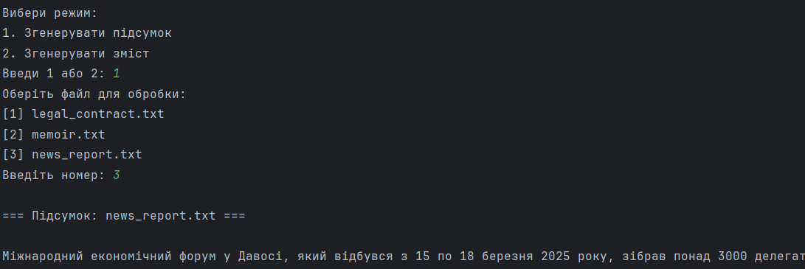

# AI summarizer project
Система для аналізу текстових документів з використанням LLM (OpenAI API)

## Зміст
1. [Встановлення та запуск](#встановлення-та-запуск)
2. [Приклади використання](#приклади-використання)
3. [Формат конфігурації](#формат-конфігурації)
4. [Логи та метрики](#логи-та-метрики)
5. [Діаграма системи](#діаграма-системи)

---

## Встановлення та запуск

### Вимоги
- Python 3.9 або вище
- API-ключ для моделі OpenAI 
- Telegram бот 

### Кроки:
1. Клонуйте репозиторій:
   ```bash
   git clone https://github.com/nadiina/ai-summarizer-project.git
   cd ai-summarizer-project
    ```
2. Створіть файл середовища .env на основі .example.env та вставте ваші ключ (OPENAI_API_KEY, TELEGRAM_TOKEN)
   
3. Встановіть залежності:
```bash
python -m venv venv
source venv/bin/activate  # або .\venv\Scripts\activate для Windows
pip install -r requirements.txt
```

### Запуск та приклади

1. Скрипти (CLI)
```bash
python scripts/get_summary.py шлях/до/файлу.txt
python scripts/get_contents.py шлях/до/файлу.txt
```
Для зручного тестування є можливість запустити скрипт, де обрати режим та файл з папки __example_docs__

```bash
python test_scripts_2modes.py
```


2. Веб-інтерфейс
```bash
flask --app web.app run
```
Перейдіть у браузері за адресою http://127.0.0.1:5000 та завантажте текстовий файл.

3. Режим REST API
```bash
flask --app api.endpoints run
```
POST /summary — отримати підсумок
POST /contents — отримати зміст

4. Telegram бот
```bash
python telegram_bot/bot.py
```
Надішліть .txt файл боту та виберіть режим: Summary або Contents.

## Приклади використання


